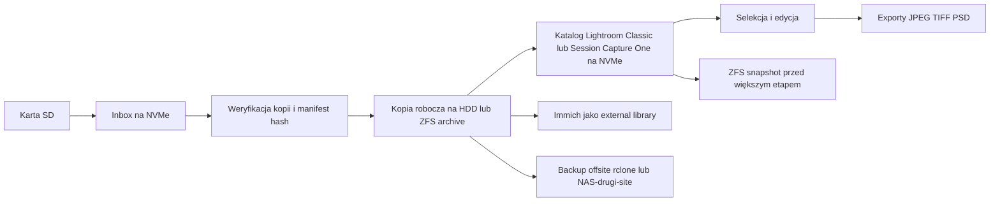

# Profesjonalny workflow fotograficzny od karty SD do archiwum, chmury i zdalnej edycji

## Executive summary

Najbardziej dojrzałe workflow fotograficzne i studyjne nie zaczynają się od „gdzie wrzucić pliki”, tylko od rozdzielenia ról magazynu: **strefa przyjęcia**, **strefa pracy**, **strefa eksportów**, **archiwum** i **kopia offsite**. W praktyce oznacza to zwykle strukturę typu `inbox -> imports -> projects -> exports -> archive`, z automatycznym lub półautomatycznym sortowaniem po dacie wykonania, a nie po dacie skopiowania. Tak działają narzędzia ingestu i automatycznego importu używane przez fotografów i studia, m.in. Photo Mechanic, Lightroom Classic i Capture One. citeturn33view1turn33view2turn16view0turn39view0

W większych zespołach i studiach wspólny mianownik jest bardzo podobny: **szybkie lokalne lub all-flash storage do aktywnej pracy**, **centralny NAS/ZFS do współdzielenia i archiwum**, oraz **wersjonowany backup offsite**. Synology promuje taki model u twórców z 10GbE i synchronizacją tła, a w case studies pokazuje jednoczesną pracę wielu edytorów; QNAP opisuje analogiczne scenariusze dla QuTS hero, Thunderbolt/10GbE i pracy na mediach wrażliwych na opóźnienia. citeturn31view0turn36view1turn36view0turn15view0turn35search4

Dla pojedynczego fotografa lub małego zespołu najlepszy kompromis zwykle wygląda tak: **karta SD zgrywana najpierw na NVMe lub szybki SSD jako „inbox/work”**, potem **kopia na HDD/NAS jako archiwum główne**, a katalog Lightroom Classic albo Session Capture One pozostaje na **lokalnym NVMe**, nigdy na udziale sieciowym. Adobe wprost nie wspiera katalogu Lightroom Classic na sieci; zamiast tego zaleca lokalny katalog i w razie potrzeby Smart Previews. Capture One również rekomenduje przechowywanie Session/Catalog na lokalnych dyskach, a nie w lokalizacjach chmurowo-synchronizowanych lub niestabilnych NAS-ach. citeturn16view3turn40search6turn40search0turn41search0turn41search8

Najważniejszy wniosek praktyczny jest prosty: **NVMe nie zawsze przyspieszy samo zgrywanie z karty**, bo często ograniczeniem jest karta, czytnik i interfejs USB, ale **bardzo przyspieszy to, co dzieje się po imporcie**: generowanie preview, cache, katalog, AI denoise, równoległe kopiowanie, checksumy i zdalną edycję. Dlatego rozsądny system to nie „wszystko na NVMe” ani „wszystko na HDD”, tylko **warstwowanie storage według etapu pracy**. citeturn22search2turn22search3turn22search15turn40search2turn40search9

## Wzorce organizacyjne w branży

Najczęściej spotykana, skalowalna struktura folderów to osobne drzewa dla przyjęcia, uporządkowanego źródła, aktywnej pracy, eksportów i długoterminowego archiwum. Jej siła polega na tym, że nie miesza ról: `inbox` jest buforem importowym, `imports` to ustandaryzowane źródło, `projects` zawiera tylko to, nad czym aktualnie pracujesz, `exports` to pliki dostarczalne, a `archive` jest prawdą źródłową po zakończeniu projektu. Photo Mechanic domyślnie tworzy foldery datowane przy ingestcie, Lightroom Classic potrafi importować z watched folderu, a Immich i ExifTool dobrze pracują z hierarchią roczno-dzienną. citeturn33view1turn16view0turn27view2turn39view0

Praktyczna struktura, którą łatwo utrzymać na Proxmox/ZFS, może wyglądać tak:

```text
/foto
  /inbox/2026-06-01_card-A/
  /imports/2026/2026-06-01_klient_sesja/
  /projects/2026/2026-06-01_klient_sesja/
  /exports/2026/2026-06-01_klient_sesja/v1_web/
  /exports/2026/2026-06-01_klient_sesja/v1_print/
  /archive/2026/2026-06-01_klient_sesja/
```

Format daty `YYYY-MM-DD` jest najwygodniejszy operacyjnie, bo dobrze sortuje się leksykograficznie, a przy tym pozostaje czytelny dla człowieka. ExifTool ma gotowe wzorce do przenoszenia plików do hierarchii opartej o `DateTimeOriginal`, a Immich domyślnie także proponuje układ `Year/Year-Month-Day/Filename.Extension`. citeturn39view0turn27view2

W nazewnictwie plików dominują dwa zdrowe podejścia. Pierwsze to **zachowanie oryginalnych nazw z aparatu** i porządkowanie wyłącznie folderami; drugie to **standaryzacja nazw na podstawie daty/czasu plus kolejny numer**, np. `20260601_153012-1.RAF`. Adobe Bridge i ExifTool od dawna wspierają masowe rename, a Photo Mechanic pozwala robić to już podczas ingestu, z użyciem zmiennych i szablonów. W większych zespołach częściej wygrywa standard nazw plus osobne metadane IPTC/XMP, bo łatwiej wtedy przenosić projekty między systemami i DAM-ami. citeturn16view1turn33view2turn39view0

W obiegu profesjonalnym **RAW, JPEG i wideo nie są traktowane identycznie**, ale też nie ma jednej obowiązkowej recepty. Najbezpieczniej jest traktować RAW jako **master**, JPEG jako **pochodną użytkową lub podglądową**, a wideo jako osobny strumień plików o innych wymaganiach I/O i innym fallbacku metadanych. Z punktu widzenia archiwum lepiej przechowywać cały zrzut z karty, jeśli materiał ma wartość dowodową lub komercyjną; z punktu widzenia aktywnej pracy lepiej odfiltrować projekty do mniejszych zestawów roboczych. Tę logikę wspierają programy ingestu, Sessions w Capture One i architektury „referenced storage” w Lightroom Classic. citeturn33view1turn33view2turn41search0turn16view3

W katalogach i DAM-ach różnica między narzędziami jest istotna. **Lightroom Classic** jest systemem katalogowym i Adobe ogólnie rekomenduje jeden główny katalog, chyba że masz wyraźny powód do podziału; katalog musi być lokalny. **Adobe Bridge/Photoshop** to model bardziej „file-browser + batch tools”: mniej wygodny do wielkiego archiwum, ale prostszy i bardziej stateless. **Capture One** daje dwa różne tryby: **Sessions** dla pojedynczych realizacji, tetheringu i łatwego przenoszenia projektu oraz **Catalogs** dla długoterminowych bibliotek. Capture One wprost opisuje Sessions jako rozwiązanie lepsze dla pojedynczych shootów i prostego backupu. citeturn16view3turn16view1turn41search0

Metadane i sidecary trzeba planować świadomie. W Lightroom Classic dla surowych RAW-ów XMP jest trzymane w osobnym pliku sidecar, a dla JPEG/TIFF/PSD/DNG zwykle w samym pliku; Adobe ostrzega jednak, że automatyczny zapis zmian do XMP może wyraźnie spowolnić pracę, więc warto go zostawić wyłączonego, jeśli nie przełączasz się ciągle między aplikacjami. Capture One potrafi czytać i aktualizować sidecary XMP dla metadanych, ale nie zapisuje regulacji obrazu do pliku źródłowego; w Session wynik pracy jest przechowywany w folderze `CaptureOne`, gdzie folder `Settings...` jest krytyczny, a cache można odtworzyć. citeturn28search13turn28search2turn40search2turn33view3turn33view4

Dedup ma dwa różne znaczenia i nie warto ich mylić. **Dedup blokowy w ZFS** jest bardzo pamięciożerny i OpenZFS wyraźnie ostrzega, żeby nie włączać go bez silnego powodu i odpowiednio zaplanowanego hardware; do workflow fotograficznego lepiej zwykle użyć kompresji, checksum, manifestów plikowych i dedupu na poziomie backupu. QNAP używa QuDedup właśnie po stronie backupu, a nie jako domyślnego mechanizmu pracy na aktywnych plikach. Immich z kolei wykrywa duplikaty po hashach tylko dla upload libraries, i to per-library, nie globalnie dla wszystkich external libraries. citeturn32view0turn30search18turn30search11turn27view5

W realnych wdrożeniach firmowych schemat się potwierdza. Synology pokazuje scenariusze, w których twórcy używają 10GbE, synchronizacji w tle i centralizacji danych; Pixel Village opisało poprawę współpracy między montażystami, kolorystami i fotografami; Bonfire Labs używa all-flash i szybkiego file servera do współpracy zdalnej. QNAP prezentuje analogiczne historie u fotografów i producentów mediów, zwłaszcza tam, gdzie liczą się Thunderbolt, 10GbE i wspólne repozytorium materiałów. citeturn31view0turn36view1turn36view0turn36view2

## Trzy rekomendowane workflow

Dla środowiska podobnego do Twojego — Proxmox, ZFS, lustro HDD, lustro NVMe, Immich obok — sensowne są trzy warianty końcowe. Pierwszy to **HDD-first archive**: karta SD trafia do `inbox`, potem niemal od razu do uporządkowanego archiwum na HDD/ZFS, a NVMe służy jedynie jako cache katalogu, preview i krótkotrwała przestrzeń robocza. Ten model jest tani i bardzo bezpieczny, ale wolniejszy podczas selekcji, budowy preview i cięższych operacji AI. Z punktu widzenia backupu i archiwum jest jednak bardzo zdrowy. citeturn16view3turn40search0turn32view0turn14view5

Drugi wariant to **NVMe-first fast-edit**: najpierw pełny ingest na NVMe, tam odbywa się weryfikacja, culling, katalog, Smart Previews, ewentualny Photoshop/Capture One, a dopiero potem materiał jest synchronicznie lub wsadowo przenoszony do `archive` na HDD/NAS. To model najwygodniejszy dla Lightroom Classic i Capture One, bo obie aplikacje najlepiej czują się z lokalnym katalogiem/session i szybkimi preview. Jest też najpraktyczniejszy, jeśli planujesz zdalną edycję przez RDP/Parsec lub chcesz potem wystawić aktualny projekt do chmury. citeturn16view3turn40search6turn40search0turn41search0turn41search8

Trzeci wariant to **cloud-native lub cloud-assisted**: oryginały są szybko wysyłane do ekosystemu chmurowego albo chmura jest miejscem pracy nad preview/derywatami, a lokalnie trzymasz tylko cache lub kopię bezpieczeństwa. W praktyce najczyściej robi się to w Lightroomie cloudowym, który oferuje edycję w przeglądarce, przechowuje oryginały w chmurze i pozwala utrzymywać lokalną kopię wszystkich oryginałów. Capture One Live jest natomiast bardziej narzędziem do zdalnego review, ocen i tagów niż pełnym cloud-native DAM-em do ciężkiej edycji. Dla wielkich zespołów sensowny jest także model „data stays on storage, user sees only pixels” przez zdalny desktop lub GPU VM. citeturn17search1turn17search3turn17search7turn18search2turn18search5turn18search20turn19search3turn19search1

Poniższa tabela jest syntetyczną oceną tych trzech podejść, opartą na dokumentacji Adobe, Capture One, Synology, QNAP, OpenZFS oraz protokołów SMB/NFS. citeturn16view3turn41search0turn31view0turn15view0turn32view0turn37view0

| Podejście            | speed                                     |        cost |          complexity |                                                     reliability | best-for                                      |
| -------------------- | ----------------------------------------- | ----------: | ------------------: | --------------------------------------------------------------: | --------------------------------------------- |
| HDD-first archive    | Średnia przy imporcie, niższa przy edycji |       Niski |               Niska |                                                          Wysoka | Archiwum, hobby-pro, długie przechowywanie    |
| NVMe-first fast-edit | Wysoka                                    |      Średni |             Średnia |                     Wysoka, jeśli szybko schodzi na HDD/offsite | Lightroom Classic, Capture One, zdalna edycja |
| Cloud-native         | Zmienna, zależna od łącza i providerów    | Wysoki OPEX | Średnia do wysokiej | Wysoka operacyjnie, ale zależna od internetu i polityk dostawcy | Zespoły rozproszone, szybki review, mobilność |

Najbardziej uniwersalny przebieg „import -> edycja -> archiwum” dla Twojego typu środowiska wygląda tak: najpierw **SD do NVMe inbox**, potem **weryfikacja**, następnie **kopia na HDD archive**, dopiero potem **praca katalogowa** i **eksporty**, a na końcu **snapshot + offsite**. To zgodne zarówno z praktyką twórców korzystających z NAS, jak i z ograniczeniami Lightroom Classic/Capture One wobec katalogów sieciowych. citeturn31view0turn16view3turn41search0turn14view4turn32view0



## Narzędzia i automatyzacja

Na Proxmox/OpenZFS najlepiej od razu wydzielić osobne datasety dla pracy i archiwum. OpenZFS automatycznie montuje datasety według `mountpoint`, a `zfs create` potrafi utworzyć je wraz z właściwościami już na starcie. W Proxmox dodatkowe storage zwykle podłącza się przez mountpoint datasetu jako Directory storage. citeturn7search0turn32view1

```bash
# przykład pod Twoje nazwy pul
zfs create -o mountpoint=/nvme-mirror/foto nvme-mirror/foto
zfs create -o mountpoint=/nvme-mirror/foto/inbox nvme-mirror/foto/inbox
zfs create -o mountpoint=/nvme-mirror/foto/projects nvme-mirror/foto/projects

zfs create -o mountpoint=/hdd-mirror/foto hdd-mirror/foto
zfs create -o mountpoint=/hdd-mirror/foto/imports hdd-mirror/foto/imports
zfs create -o mountpoint=/hdd-mirror/foto/archive hdd-mirror/foto/archive
zfs create -o mountpoint=/hdd-mirror/foto/exports hdd-mirror/foto/exports
```

Do samego zgrywania z karty najprostszy i nadal bardzo solidny jest `rsync`. Daje powtarzalność, bezpieczeństwo transferu i wygodę logowania; przy imporcie fotograficznym ważniejsze od „sprytnej synchronizacji” jest zwykle to, żeby kopiować etapami i niczego nie usuwać z karty przed weryfikacją. citeturn25view0

```bash
# etap 1: zgrywanie z karty do szybkiego inboxu na NVMe
mkdir -p /nvme-mirror/foto/inbox/2026-06-01_card-A
rsync -avh --info=progress2 /mnt/sdcard/ /nvme-mirror/foto/inbox/2026-06-01_card-A/

# etap 2: lokalna kopia z NVMe do uporządkowanego źródła na HDD
mkdir -p /hdd-mirror/foto/imports/2026/2026-06-01_card-A
rsync -avh --info=progress2 /nvme-mirror/foto/inbox/2026-06-01_card-A/ \
  /hdd-mirror/foto/imports/2026/2026-06-01_card-A/
```

Jeżeli chcesz od razu sortować po EXIF i zachować źródło nietknięte, ExifTool ma do tego gotowe wzorce. Dokumentacja pokazuje zarówno **przenoszenie**, jak i **kopiowanie** do struktury `rok/miesiąc/dzień`; kluczowe jest użycie `-o .`, jeśli chcesz kopiować zamiast przenosić. To jest bardzo dobry mechanizm do budowy `imports` lub `archive` z datą wykonania zdjęcia. citeturn39view0

```bash
# kopia z inboxu do archiwum według DateTimeOriginal
exiftool -r -o . '-Directory<DateTimeOriginal' -d /hdd-mirror/foto/archive/%Y/%m/%d \
  /nvme-mirror/foto/inbox/2026-06-01_card-A
```

Jeśli chcesz dodatkowo standaryzować nazwę pliku, możesz to zrobić w tym samym narzędziu. Przy materiałach z mieszanych aparatów rozsądnie jest dodać licznik kolizji i zachować rozszerzenie. Przed puszczeniem na cały zbiór warto zawsze przetestować na 10–20 plikach w osobnym katalogu. citeturn39view0

```bash
# przykładowy rename na podstawie CreateDate
exiftool -r '-FileName<CreateDate' -d %Y%m%d_%H%M%S%%-c.%%e \
  /nvme-mirror/foto/projects/2026/2026-06-01_klient_sesja
```

Dla materiałów bez sensownego EXIF, zwłaszcza części wideo, zrób drugi przebieg z fallbackiem do `FileModifyDate`. To nie jest idealny ekwiwalent „momentu wykonania”, ale jest dużo lepsze niż mieszanie takich plików w głównej osi dat projektu bez żadnego oznaczenia. citeturn39view0turn11search1

```bash
# fallback dla plików bez DateTimeOriginal
exiftool -r -if 'not $DateTimeOriginal' -o . '-Directory<FileModifyDate' \
  -d /hdd-mirror/foto/archive/_brak_exif/%Y/%m/%d \
  /nvme-mirror/foto/inbox/2026-06-01_card-A
```

Do synchronizacji roboczej z chmurą warto rozdzielić dwa przypadki. **Archiwum** najlepiej robić `rclone sync` lub `copy` jednokierunkowo, najlepiej z szyfrowaniem `crypt`. **Foldery projektowe między dwoma końcami** można robić `rclone bisync`, ale trzeba pamiętać, że jest to narzędzie do współdzielonych katalogów plików, nie do współbieżnego ruszania baz katalogowych typu `.lrcat` czy `cocatalogdb`. citeturn25view1turn25view2turn16view3turn41search0

```bash
# przykład offsite encrypted backup
rclone sync /hdd-mirror/foto/archive b2crypt:foto-archive \
  --transfers 8 --checkers 16 --log-file /var/log/rclone-photo.log --log-level INFO

# weryfikacja sum po stronie remote
rclone check /hdd-mirror/foto/archive b2crypt:foto-archive --one-way
```

Jeżeli wolisz synchronizację peer-to-peer między komputerem edycyjnym a serwerem, Syncthing i Nextcloud mają sens, ale znowu: raczej dla **projektów i eksportów**, nie dla otwartych katalogów aplikacji. Syncthing ma wersjonowanie per-folder i per-device, natomiast Nextcloud wspiera external storage, WebDAV, locking transakcyjny i wirtualne pliki; to świetne dla dokumentów i wybranych assetów, ale nie jest to idealne miejsce na „żywe” bazy Lightroom/Capture One. citeturn25view4turn25view5turn25view6turn26view0turn26view1

Adobe i Camera Bits dostarczają już sporo automatyki bez własnych skryptów. Lightroom Classic ma watched folder / Auto Import, ale nie monitoruje podfolderów i wymaga pustego watched folderu. Photo Mechanic potrafi ingestować z wielu kart jednocześnie, kopiować od razu do **Primary** i **Secondary Destination**, zachować źródłową strukturę katalogów z karty albo ją spłaszczyć, a także nakładać szablony IPTC i renamować przy imporcie. Capture One Studio oferuje Session Builder do automatycznego tworzenia zagnieżdżonych folderów sesji. citeturn16view0turn33view1turn33view2turn33view5

## Backup, wydajność i bezpieczeństwo

Polityka backupowa, która naprawdę działa przy zdjęciach i filmach, nadal wygląda jak **3-2-1**: co najmniej trzy kopie, na dwóch różnych typach nośników, z jedną kopią poza lokalizacją. Synology wprost promuje 3-2-1 jako najlepszą praktykę dla zdjęć, filmów i danych firmowych; różnicuje też wyraźnie backup od synchronizacji — backup jest punktowy i wersjonowany, sync utrzymuje bieżący stan. To bardzo ważne, bo ludzie zbyt często mylą „mam to zsynchronizowane” z „mam to bezpiecznie zbackupowane”. citeturn14view4turn38view0

W środowisku ZFS i Btrfs filarem bezpieczeństwa są snapshoty. OpenZFS tworzy snapshoty niemal natychmiast, początkowo bez dodatkowego zużycia przestrzeni, a Synology opisuje to samo dla Btrfs shared folders, z możliwością częstego planowania i samodzielnego odzysku wcześniejszych wersji przez użytkowników. Dla aktywnej pracy fotograficznej oznacza to, że możesz robić snapshot **przed importem, przed dużą selekcją, przed batch rename i przed migracją do archiwum**. citeturn32view0turn14view5turn14view0

Na QNAP podobny sens mają wielowersyjne backupy HBS 3 i Qsync versioning, ale trzeba pamiętać, że QuDedup dotyczy backupów, a nie codziennej pracy na plikach. Na Synology podobną rolę pełnią Snapshot Replication i wersjonowanie w Synology Drive. Jeśli robisz współdzielenie projektów między urządzeniami, wersjonowanie powinno być obowiązkowe. citeturn15view2turn15view3turn15view4turn14view1turn14view2

Wydajnościowo najczęściej pierwszy bottleneck jest banalny: **karta SD + czytnik + USB**, a nie docelowy dysk. SD Association pokazuje, że starsze tryby SD są dużo wolniejsze niż nowoczesne storage, UHS-II ma dwa poziomy 152 i 312 MB/s, a USB 3.2 występuje w odmianach 5, 10 i 20 Gbps. Dlatego przy typowym zgrywaniu z pojedynczej karty UHS-I albo przeciętnego czytnika różnica między HDD a NVMe bywa mała; dopiero po imporcie NVMe robi wyraźną różnicę przy preview, cache, Lightroom Develop, AI i równoległych operacjach. citeturn22search2turn22search15turn22search3turn40search2turn40search9

Sieć również trzeba dobrać do charakteru pracy. Dla Windows i większości desktopowych workflow foto najwygodniejszy będzie **SMB**, a Microsoft dokumentuje, że SMB Multichannel jest domyślnie włączony, agreguje przepustowość i zwiększa odporność, jeśli masz wiele ścieżek lub odpowiednie karty sieciowe. **NFS** ma sens w mieszanych środowiskach Linux/UNIX i przy wirtualizacji czy kontenerach. **iSCSI** jest świetne jako blokowy storage dla hypervisorów i niektórych aplikacji, ale dla typowego folderowego workflow fotograficznego zwykle jest po prostu bardziej skomplikowane niż potrzeba. citeturn37view0turn37view1turn37view2turn23search12

Jeśli chcesz edytować bezpośrednio z NAS, granicą komfortu jest zwykle przejście na **10GbE** albo modele z Thunderbolt dla małych studiów kreatywnych. Synology i QNAP obie firmy pozycjonują 10GbE, NVMe i Thunderbolt jako warunek sensownej pracy na dużych RAW-ach i wideo 4K/8K. W małym studiu oznacza to w praktyce: katalog i preview lokalnie, oryginały na NAS, a nie odwrotnie. citeturn31view0turn14view7turn35search7turn23search13turn23search17

Na poziomie bezpieczeństwa dostępu najważniejsze są rzeczy nieefektowne: **oddzielne udziały lub datasety dla inbox, projects, exports i archive; brak wystawiania całego systemu plików serwera; konta per użytkownik; tylko potrzebne prawa zapisu; share links z terminem ważności; aplikacyjne hasła do WebDAV**. Synology Drive daje granularne prawa i linki czasowe, Nextcloud zaleca app passwords do WebDAV i oferuje transactional file locking oraz hardening serwera. citeturn31view0turn26view1turn25view6turn25view7

Osobne ostrzeżenie należy się dedupowi w OpenZFS. To nie jest dobra „automatyczna oszczędność miejsca” dla serwera foto na ślepo; OpenZFS podaje duże wymagania RAM i ryzyko problemów wydajnościowych oraz administracyjnych. W praktyce lepiej wybrać kompresję, snapshoty, wersjonowanie i dedup backupowy po stronie narzędzi takich jak QuDedup czy systemy obiektowe, niż włączać blokowy dedup na Twoim głównym poolu zdjęć. citeturn32view0turn30search11

## Lightroom zdalnie i Immich

Dla **Lightroom Classic zdalnie** najlepsze praktyczne ustawienie jest bardzo konsekwentne: **`.lrcat`, preview i Smart Previews na lokalnym NVMe komputera, z którego faktycznie edytujesz; oryginały na HDD/NAS/ZFS; zero katalogu na SMB**. Adobe wprost mówi, że katalog nie może być na sieci, ale zdjęcia mogą. Jednocześnie Smart Previews pozwalają pracować nawet wtedy, gdy oryginał jest odłączony, a opcja „Use Smart Previews instead of Originals” dodatkowo poprawia płynność Develop. To jest najbezpieczniejszy model dla pracy lokalnej i zdalnej. citeturn16view3turn40search6turn40search0turn40search9

Jeśli zależy Ci na prawdziwie wygodnej edycji „z chmury”, masz trzy sensowne drogi. Pierwsza to **Lightroom cloudowy / Lightroom on the web**: edycja w przeglądarce, oryginały w chmurze Adobe, opcjonalna lokalna kopia wszystkich oryginałów, a w planach zespołowych 1 TB storage per user. Druga to **Capture One Live**, ale głównie do review, ocen, tagów i współpracy z klientem przez przeglądarkę. Trzecia, często najbardziej profesjonalna dla ciężkiego LR Classic / Photoshop / Capture One, to **zdalny desktop do maszyny stojącej obok storage** — czy to własnej stacji roboczej, czy GPU VM w Azure NV albo środowisku opartym o AWS G5/Nimble Studio. Wtedy przez internet idą piksele i input, a nie setki gigabajtów RAW-ów. citeturn17search1turn17search3turn17search6turn31view2turn18search2turn18search5turn18search20turn19search3turn19search1turn19search12

Dla **Immich** najrozsądniejszy model integracji z workflow foto to potraktować go jako **warstwę przeglądania, wyszukiwania i współdzielenia**, a nie jako główny system aktywnej edycji Lightroom/Capture One. Immich bardzo dobrze wspiera external libraries, ma folder view, harmonogram rescanów i storage templates, ale oficjalnie nie umie zachować istniejącej struktury albumów przy external library, a duplicate checking dla external libraries nie jest globalny. Do tego, jeśli external library jest read-only, Immich nie zapisze plików `.xmp`. citeturn27view0turn27view1turn27view2turn27view4turn27view5

Praktyczna rekomendacja dla Ciebie wyglądałaby tak: **archiwum źródłowe i gotowe eksporty** podłącz do Immich jako **external libraries**; jeśli Lightroom/Capture One ma być źródłem prawdy o metadanych, montuj je w Immich raczej **read-only**; jeśli chcesz, żeby Immich zapisywał opis, gwiazdki lub lokalizację do XMP, wydziel osobny zestaw folderów i licz się z sidecarami. Dla bieżącej pracy trzymaj `projects` poza Immich albo skanuj je dopiero po zamrożeniu projektu. To ogranicza konflikty metadanych i bałagan w timeline. citeturn27view1turn27view5turn33view3turn28search13

Jeżeli chcesz połączyć oba światy, dobry układ jest taki: **telefon i rodzinne zdjęcia** trafiają do zwykłej upload library Immich; **archiwum foto/wideo z aparatów** trafia jako external library; **Lightroom Classic** pracuje na aktualnych projektach z katalogiem lokalnym i Smart Previews; po zakończeniu projektu materiał spada do `archive`, dostaje snapshot ZFS, backup offsite i dopiero wtedy idzie do długiego indeksowania w Immich. To nie tylko porządkuje dane, ale też nie zapycha katalogu Lightroom gigantycznym, stale rosnącym zbiorem wszystkiego naraz. citeturn27view0turn27view1turn27view4turn16view3turn40search0turn14view4turn32view0

Za najbardziej „nośne” źródła wdrożeniowe do takiego systemu uznałbym dokumentacje **Adobe Lightroom Classic i Lightroom**, **Capture One**, **Synology**, **QNAP**, **OpenZFS**, **Immich**, **Nextcloud**, **Microsoft SMB/NFS**, oraz praktyczne instrukcje **Photo Mechanic**, **ExifTool**, **rsync** i **rclone**. To są materiały, do których warto wracać przy podejmowaniu konkretnych decyzji o katalogu, sidecarach, snapshotach, synchronizacji i zdalnym dostępie. citeturn16view3turn40search0turn41search0turn31view0turn15view0turn32view0turn27view1turn25view5turn37view0turn33view1turn39view0turn25view0turn25view2
